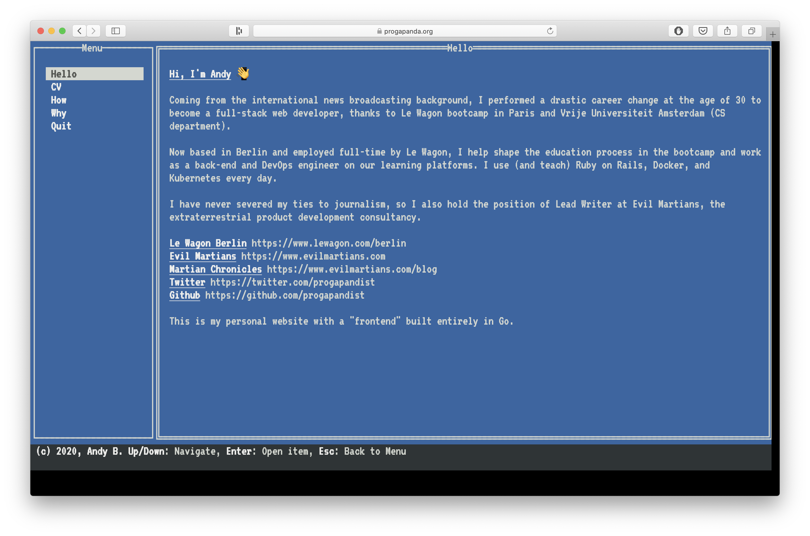
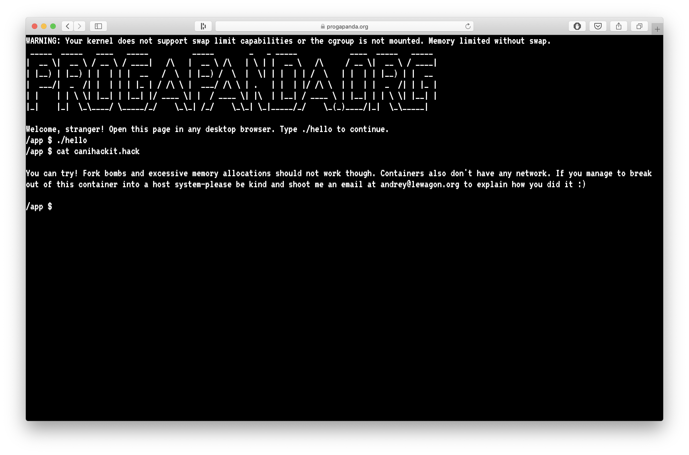

# progapanda.org

Source code for https://progapanda.org

## Stack:

- Go
- Gorilla Mux
- WebSocket
- [tview](https://github.com/rivo/tview) for Go TUI (not in this repo)
- Svelte.js
- Xterm.js
- Docker
- k3s with [k3sup](https://github.com/alexellis/k3sup)
- Digital Ocean $10 droplet :ok_hand:

## Why?

This is part of my research for creating scalable online coding environments for programming students at [Le Wagon](https://www.lewagon.com)

## Other OSS projects

- [lewagon/wait-on-check-action](https://github.com/lewagon/wait-on-check-action), the GitHub Action that can be used to halt any workflow until required checks for a given ref pass successfully.
- [lewagon/foot_traffic](https://github.com/lewagon/foot_traffic), pure Ruby DSL for Chrome scripting based on Ferrum. No Selenium required. Works from any script. Simulate web app usage scenarios in production or locally.
- [lewagon/quay-github-actions-dispatch](https://github.com/lewagon/quay-github-actions-dispatch), a tiny web service for securely forwarding Quay build notifications to Github Action's repository_dispatch webhook. A missing link for creating powerful build flows with Quay and GHA.

## Contact me

andrey@lewagon.org

## License

MIT
